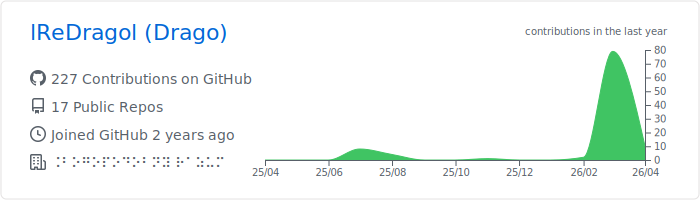
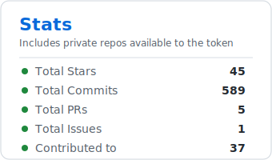
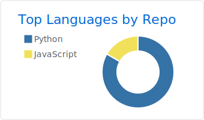

<!--
Profile variant: Dashboard (light)
Usage: copy this file into README.md when you want to switch the active profile.
-->

  

<h1 align="center">Drago (lReDragol)</h1>

  Automation • Python • C# • JavaScript
   
  <a href="https://aero-storage.ldragol.ru">Website</a> •
  <a href="https://www.youtube.com/@drago5210">YouTube</a> •
  <a href="https://github.com/lReDragol?tab=repositories">Repositories</a>

## What I do

- Build small tools and automations that save time
- Write bots/clients (mostly Python)
- Like clean UX for scripts: logs, configs, and practical docs

## Featured projects

| Project | Summary |
| --- | --- |
| [OnceHuman_Tools](https://github.com/lReDragol/OnceHuman_Tools) | Tools around Once Human (RU/EN docs) |
| [bybit-info-bot](https://github.com/lReDragol/bybit-info-bot) | Telegram bot for monitoring Bybit balance + charts |
| [Icon-Creator](https://github.com/lReDragol/Icon-Creator) | Tkinter app for creating/editing `.ico` icons (text/gradient/logo) |
| [Fast-voice-recognition](https://github.com/lReDragol/Fast-voice-recognition) | Fast voice recognition (Python) |
| [ESCgram](https://github.com/lReDragol/ESCgram) | WIP Telegram GUI client |
| [Tampermonkey](https://github.com/lReDragol/Tampermonkey) | Browser userscripts (Steam recommendations, etc.) |

## Toolbox

`Python` · `C#` · `JavaScript` · `Linux` · `Git` · `Docker`

  
<b>GitHub stats</b>

   

  

    
  

  

    
    
  

