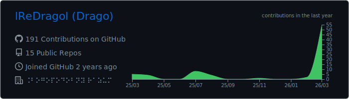
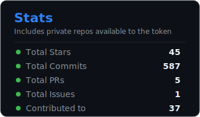
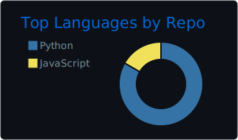

<!--
Profile variant: Minimal (text-first, dark cards)
Usage: copy this file into README.md when you want to switch the active profile.
-->

# Drago (lReDragol)

I build practical tools and automation, mostly in Python, and sometimes in C#/JavaScript.  
I like projects that are simple to run, easy to maintain, and pleasant to use.

- Website: https://aero-storage.ldragol.ru
- YouTube: https://www.youtube.com/@drago5210

## Selected work

- [OnceHuman_Tools](https://github.com/lReDragol/OnceHuman_Tools) — tools around Once Human (RU/EN docs)
- [bybit-info-bot](https://github.com/lReDragol/bybit-info-bot) — Telegram bot for monitoring Bybit balance + charts
- [Icon-Creator](https://github.com/lReDragol/Icon-Creator) — desktop icon editor (Tkinter, `.ico`)
- [Fast-voice-recognition](https://github.com/lReDragol/Fast-voice-recognition) — fast voice recognition (Python)

  
<b>Stats</b>

   

  

    
  

  

    
    
  

